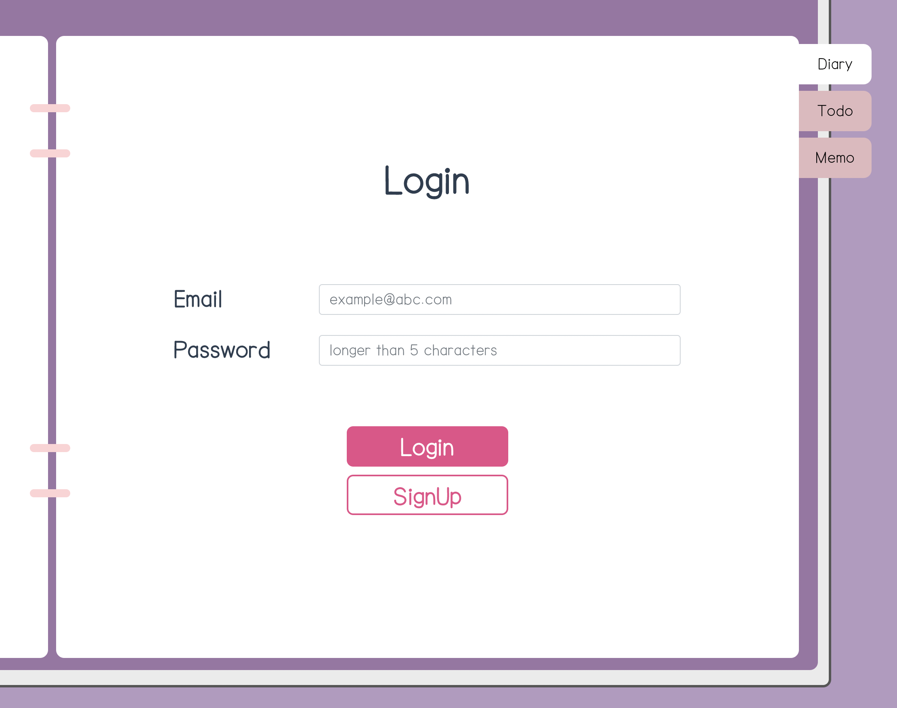
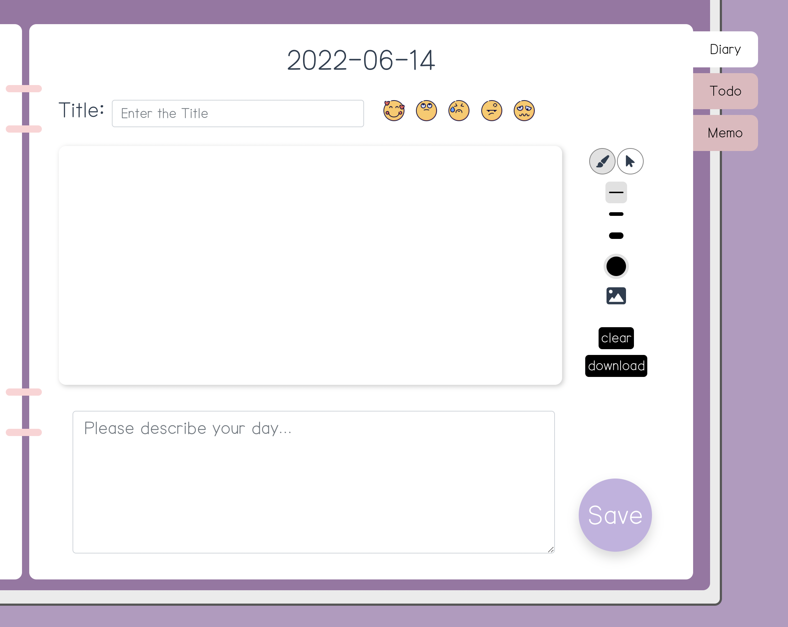
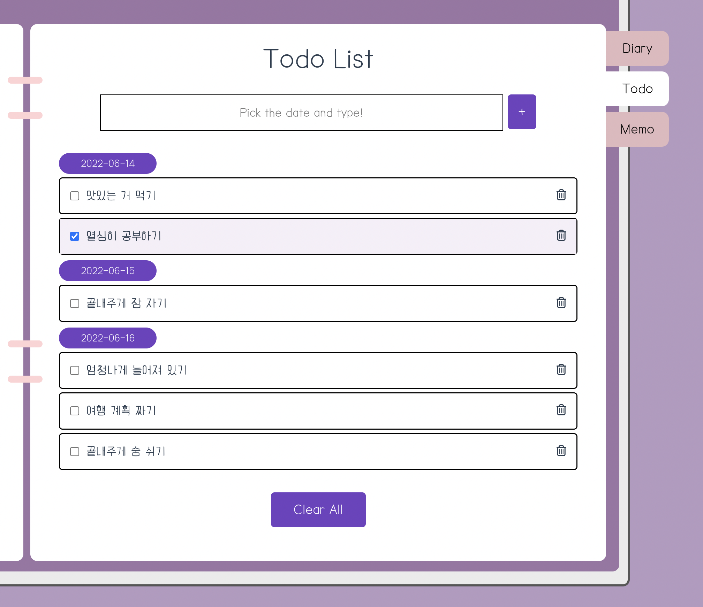
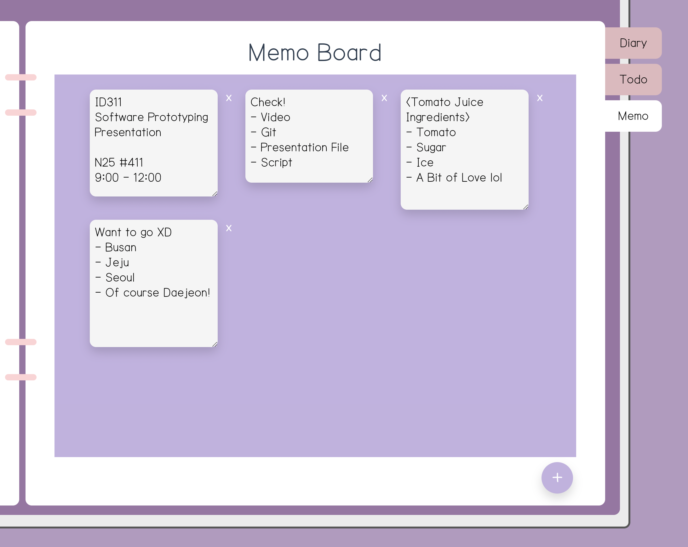
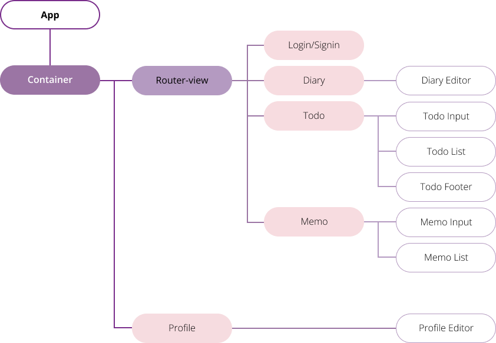
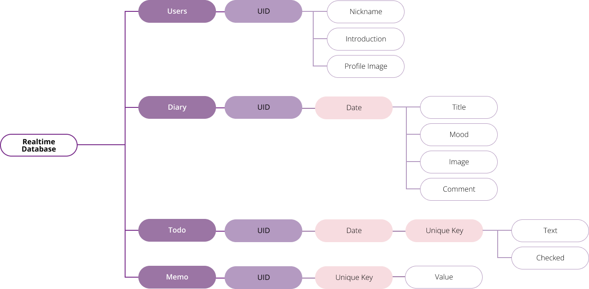

# ID311 Final Group Project, ***My World***

- [ID311 Final Group Project, ***My World***](#id311-final-group-project-my-world)
  - [1. Basic Info](#1-basic-info)
  - [2. Description of the Application](#2-description-of-the-application)
    - [1) Login](#1-login)
    - [2) Profile](#2-profile)
    - [3) Diary](#3-diary)
    - [4) Todo](#4-todo)
    - [5) Memo](#5-memo)
  - [3. Organization of the Code](#3-organization-of-the-code)
    - [1) Front-end](#1-front-end)
    - [2) Back-end](#2-back-end)
    - [3) DB Structure](#3-db-structure)
  - [4. Issue](#4-issue)
    - [1) Special Features](#1-special-features)
    - [2) Known Bugs](#2-known-bugs)
  - [5. Tried Novel Feature & Library & Tool](#5-tried-novel-feature--library--tool)
    - [1) Vue](#1-vue)
    - [2) BootstrapVue](#2-bootstrapvue)
    - [3) Vuetify](#3-vuetify)
    - [4) Fabric](#4-fabric)
  - [6. Main Challenges](#6-main-challenges)
    - [1) Vue](#1-vue-1)
    - [2) Firebase](#2-firebase)
    - [3) Responsive Web Design](#3-responsive-web-design)
    - [4) Git](#4-git)
  - [7. Improvement Measures](#7-improvement-measures)
    - [1) Responsive Web Design](#1-responsive-web-design)
    - [2) Todo List Sorting](#2-todo-list-sorting)
    - [3) Diary Drawings](#3-diary-drawings)
  - [8. Reference & Helps](#8-reference--helps)
  
## 1. Basic Info
- **Team Number**: 2
- **Team Member**: Minhee Kim, Yena Kim, Yumin Cho
- **URL to Repository**: [Git Repository]()
- **URL to Demo**: [Application](https://id311-my-world.web.app/)
- **URL to Video**: [Demo Video]()

## 2. Description of the Application
There are `5` big pages in ***My World***: `Login`, `Profile`, `Diary`, `Todo`, and `Memo`.
### 1) Login

    

        
 This is the first page you meet when you visit our application. You can <i>Login</i> or <i>SignUp</i> here. All of the contents you remain will be saved personally so that you can archive every thing. Please be careful to write down your email account properly! It only accepts the valid type of the address. If you type wrong, it will alert you.

    

### 2) Profile

    

        
After you sign in, you can see your profile. Your name will be set to the default name your account has. The image and introduction will have the default value we provide. You can edit the profile anytime you want by clicking the pencil emoji.

        
 Also, there is a calendar below the profile. You can check the date of today here. Next in the <code>Diary</code> and <code>Todo</code>, you are going to use this calendar a lot. Please stay tuned! 

    

### 3) Diary

    

        
When you click the <code>Diary</code> tab, the page consists of many inputs and buttons will be shown. It's the diary of <strong>today</strong>. You can add the title and contents, select the mood, and draw anything on canvas. We're going to tell you more about <strong>canvas</strong> on the following chapters.

        

            If you want to see or edit those of the other dates, please select the specific one on the calendar. There are 3 cases possible:
             
            (1) It's a past date && there's saved data.
             
            (2) It's a past date && there's no saved data.
             
            (3) It's a future date.
        

        

            Each case, it works like this:
             
            (1) You can see the saved data and edit it.
             
            (2) You can write the diary of that day. It's not too late!
             
            (3) You can't do anything.
        

    

### 4) Todo

    

        
To add something on the <code>Todo</code> tab, the very first step is selecting the date on the calendar. Typing something in the input box and press the <code>+</code> button, it will be added in the list of that day. But you don't have to be afraid of making mistakes; you can delete them. If you want to remove all at once, just click the <code>Clear All</code> button.

    

### 5) Memo

    

        
Last but not least, it's <code>Memo</code> board. Pressing the <code>+</code> button, a new empty sticky note will be created. You can write down anything on it.

        
Oops! Did you write too much on the memo? Then just try adjusting its height or simply scroll down to see all the contents inside. Similarly, if you make too many memos, scroll the whole memo board.

    

## 3. Organization of the Code
### 1) Front-end

### 2) Back-end
- **Authentication**
  - Because this is private diary, users should make their own account. You can use valid format email address and password, which managed by firebase authentication. When an account is created, a UID is given. In our service, this UID is stored in local storage and is a major factor in authenticating users.
- **Realtime Database**
  - Database is structured into 4 categories: `Users`, `Diary`, `Todo`, `Memo`. Each category has a sublayer classified by UID.
- **Storage**
  - For diary's drawing and user profile image, we used firebase storage to save them. After uploading the image file, we saved its url into the db and loaded it later.
### 3) DB Structure

## 4. Issue
### 1) Special Features
- **Auto-Save**
  - To-do list and memo board are auto-saved every time you add or remove something. You don't have to do that manually.
- **Interaction** between Elements and a Pointing Device
  - On the `Diary` tab, you can choose the mood of the day. When you put the cursor on the image, its size becomes bigger. If you remove the cursor, it shrinks again. If you click it, its size is fixed to the bigger one.
- **`Calendar`**
  - The calendar is shown regardless of the tab, and interacts with many components at once. More in detail, we use the same calendar both on the `Diary` and `Todo` tab. 
    - `Diary`
      - You can pick the date to see the diary of that day.
      - When you choose the mood and save, the small colored dot will be marked on the calendar. Those dots can have different colors responding to the mood of that day.
    - `Todo`
      - You can pick the date before adding the to-do thing.
  - Features were descripted more in detail in the [2. Description of the Application](#2-description-of-the-application). 
- **Web Page Icon & Title**
  - On the top of the window opening our application, you can see the tab with the icon of ***My World*** and the title "myworld".
### 2) Known Bugs
- `Welcome_KAIST` Connecting Problem
  - A very weird thing happens when we connect the Wi-Fi `Welcome_KAIST` provided by KAIST and visit the application. You can't save the diary! It keeps making timeout when request to firebase storage only to fail. However, using other Wi-Fi or your own hotspot, it works normally again. We tried to fix this bug, but finally we decided that this wan't our problem, but `Welcome_KAIST`'s.

## 5. Tried Novel Feature & Library & Tool
### 1) [Vue](https://vuejs.org/)
This is the introduction in the official website of Vue:
> **Vue** is a _JavaScript framework_ for building user interfaces. It builds on top of standard HTML, CSS and JavaScript, and provides a declarative and component-based programming model that helps you efficiently develop user interfaces, be it simple or complex.

We used the **module system** of Vue to control overall data in the application. In our code, a single .vue file works as the single independent component. Parent components import child components, and get or send the property data. Child components export what they have to their parents.

Also, ***My World*** is a single page application based on Vue Router.

### 2) [BootstrapVue](https://bootstrap-vue.org/)
This is the introduction in the official website of BootstrapVue:
> **BootstrapVue** is the popular front-end CSS library. With it, you can build responsive, mobile-first, and ARIA accessible projects on the web using Vue.js.

We first tried to use the components provided by BootstrapVue including calendar, input radio, etc. And actually, we found that it worked really well. It let us control the data easily. But the only problem was the design style. We thought that it didn't match to our application concept. So we decided to use another library, _Vuetify_. We also made and customized some of them ourselves.

### 3) [Vuetify](https://vuetifyjs.com/en/)
This is the introduction in the official website of Vuetify:
> **Vuetify** is a Vue UI Library with beautifully handcrafted Material Components. No design skills required — everything you need to create amazing applications is at your fingertips.

We used Vuetify to create and manage the `calendar`.
### 4) [Fabric](http://fabricjs.com/)
This is the introduction in the official website of Fabric.js:
> **Fabric.js** is a powerful and simple Javascript HTML5 canvas library. Fabric provides interactive object model on top of canvas element. Fabric also has SVG-to-canvas (and canvas-to-SVG) parser.

We used Fabric.js to create and manage the `canvas` in the `Diary` tab. You can select the brush color and size. It's also possible to upload the images you want and edit them freely. After drawing all, download and keep it. It's a really strong feature of Fabric.js.

## 6. Main Challenges
### 1) Vue
All 3 team members were new to Vue. The followings are what we studied and used a lot:
- Basic Grammar
- Reactivity
- Defining a Component
- Single-File Components
- Form Input Binding
- Event Handliing
- Prop Declaration & Passing
- Plugins
- Routing
- etc
### 2) Firebase
***MyWorld*** is a serverless web application uses database which is a Firebase Realtime DB. Firebase db uses NoSQL, JSON type script. We used it for basic CRUD functionalities and also used Firebase Storage to store images. Also, for user signin and signup, we used Firebase Authentication especially the email method. Finally, deployed this web app using Firebase hosting.
### 3) Responsive Web Design
_Responsive Web Design_ is about using HTML and CSS to automatically resize, hide, shrink, or enlarge, a website, to make it look good on all devices. We make ***My World*** a responsive web to allow the user to see whole thing regardless of the size or proportion of the display. So when you change the size of the window, most elements are resized and relocated.
### 4) Git
Our team members don't have much experience of sharing the git repository with others. We tried to make different branches depending on the purpose and leave the clear message with each commit.

## 7. Improvement Measures
### 1) Responsive Web Design
Still, there are some issues with the layout. It doesn't fit that well if you shrink or enlarge the window. If you change the size of the system font, some elements overlap each other or escape the parent container. We can fix these problems further by refining CSS.
### 2) Todo List Sorting
Now, the elements in the todo list are sorted in the saved-order and just be distinguished between what you've done and what you've not done yet. So even if you've done what you made lately first, its order must go down. Vice versa, if you've done what you made early late, its order must go up. Additional functions are needed here.
### 3) Diary Drawings
Once you save the drawings on the Diary tab, there is no possible way to edit. You must do all over again if you want to change it. Applying the different method for saving can be the solution.

## 8. Reference & Helps
- [cyworld](https://cyworld.com/cyworld/welcome)
- [Vue](https://vuejs.org/)
- [BootstrapVue](https://bootstrap-vue.org/)
- [Vuetify](https://vuetifyjs.com/en/)
- [Fabric](http://fabricjs.com/)
- [W3Schools](https://www.w3schools.com/default.asp)
- [WebKit](https://webkit.org/)
