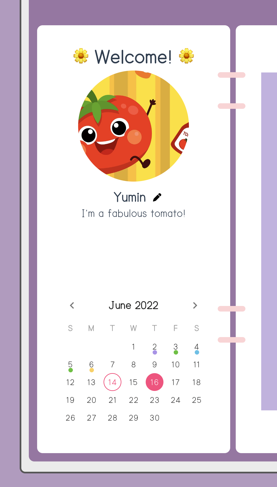

# ID311 Final Group Project
## 0. Table of Contents

- [ID311 Final Group Project](#id311-final-group-project)
  - [0. Table of Contents](#0-table-of-contents)
  - [1. Basic Info](#1-basic-info)
  - [2. Description of the Application, ***My World***](#2-description-of-the-application-my-world)
  - [3. Organization of the Code](#3-organization-of-the-code)
    - [1) Front-end](#1-front-end)
    - [2) Back-end](#2-back-end)
    - [3) Diagram](#3-diagram)
  - [4. Issue](#4-issue)
    - [1) Special Features](#1-special-features)
    - [2) Known Bugs](#2-known-bugs)
  - [5. Tried Novel Feature & Library & Tool](#5-tried-novel-feature--library--tool)
    - [1) Vue](#1-vue)
    - [2) BootstrapVue](#2-bootstrapvue)
    - [3) Vuetify](#3-vuetify)
    - [4) Fabric](#4-fabric)
  - [6. Build Setup](#6-build-setup)
  
## 1. Basic Info
- **Team Number**: 2
- **Team Member**: Minhee Kim, Yena Kim, Yumin Cho
- **URL to Repository**: [Git Repository]()
- **URL to Demo**: [Application](https://id311-my-world)web)app/)
- **URL to Video**: [Demo Video]()

## 2. Description of the Application, ***My World***
There are `5` big pages here: `Login`, `Profile`, `Diary`, `Todo`, and `Memo`.
> Login 🔑

<div style="display: flex;">
    
    <div style="padding: 10px">
        <p> This is the first page you meet when you visit our application. You can <i>Login</i> or <i>SignUp</i> here. All of the contents you remain will be saved personally so that you can archive every thing. </p>
        <p> Please be careful to write down your email account properly! It only accepts the valid type of the address. If you type wrong, it will alert you.</p>
    </div>
</div>


> Profile 😜

<div style="display: flex;">
    
    <div style="padding: 10px">
        <p>After you sign in, you can see your profile. Your name will be set to the default name your account has. The image and introduction will have the default value we provide. You can edit the profile anytime you want by clicking the ✏️ Pencil Emoji ✏️.</p>
        <p> Also, there is a calendar below the profile. You can check the date of today here. Next in the <code>Diary</code> and <code>Todo</code>, you are going to use this calendar a lot. Please stay tuned! </p>
    </div>
</div>

> Diary 📒

<div style="display: flex;">
    
    <div style="padding: 10px">
        <p>When you click the <code>Diary</code> tab, the page consists of many inputs and buttons will be shown. It's the diary of <strong>today</strong>. You can add the title and contents, select the mood, and draw anything on canvas. We're going to tell you more about <strong>canvas</strong> on the following chapters.</p>
        <p>
            If you want to see or edit those of the other dates, please select the specific one on the calendar. There are 3 cases possible:
            <br/>
            (1) It's a past date && there's saved data.
            <br/>
            (2) It's a past date && there's no saved data.
            <br/>
            (3) It's a future date.
        </p>
        <p>
            Each case, it works like this:
            <br/>
            (1) You can see the saved data and edit it.
            <br/>
            (2) You can write the diary of that day. It's not too late!
            <br/>
            (3) You can't do anything.
        </p>
    </div>
</div>

> Todo ✔️

<div style="display: flex;">
    
    <div style="padding: 10px">
        <p>To add something on the <code>Todo</code> tab, the very first step is selecting the date on the calendar. Typing something in the input box and press the <code>+</code> button, it will be added in the list of that day. But you don't have to be afraid of making mistakes; you can delete them. If you want to remove all at once, just click the <code>Clear All</code> button.</p>
        <p>And this to-do list is auto-saved every time you add or remove something. You don't have to do that manually.</p>
    </div>
</div>


> Memo 📝

<div style="display: flex;">
    
    <div style="padding: 10px">
        <p>Last but not least, it's <code>Memo</code> board. Pressing the <code>+</code> button, a new empty sticky note will be created. You can write down anything on it.</p>
        <p>Oops! Did you write too much on the memo? Then just try adjusting its height or simply scroll down to see all the contents inside. Similarly, if you make too many memos, scroll the whole memo board.</p>
        <p>Of course, his memo board has the auto-saved function as well.</p>
    </div>
</div>

## 3. Organization of the Code
### 1) Front-end
### 2) Back-end
### 3) Diagram

## 4. Issue
### 1) Special Features
### 2) Known Bugs
- `Welcome_KAIST` Connecting Problem
  - A very weird thing happens when we connect the wi-fi `Welcome_KAIST` provided by KAIST and visit the application. You can't save the diary! It keeps making timeout only to fail. However, using other wi-fi or your own hotspot, it works normally again. We tried to fix this bug, but finally we decided that this wan't our problem, but `Welcome_KAIST`'s.

## 5. Tried Novel Feature & Library & Tool
### 1) [Vue](https://vuejs.org/)
This is the introduction in the official website of Vue:
> ***Vue*** is a _JavaScript framework_ for building user interfaces. It builds on top of standard HTML, CSS and JavaScript, and provides a declarative and component-based programming model that helps you efficiently develop user interfaces, be it simple or complex.

We used the ***module system*** of Vue to control overall data in the application.

In our code, a single .vue file works as the single independent component. Parent components import child components, and get or send the property data. Child components export what they have to their parents.

### 2) [BootstrapVue](https://bootstrap-vue.org/)
This is the introduction in the official website of BootstrapVue:
> ***BootstrapVue*** is the popular front-end CSS library. With it, you can build responsive, mobile-first, and ARIA accessible projects on the web using Vue.js.

We first tried to use the components provided by BootstrapVue including calendar, input radio, etc. And actually, we found that it worked really well. It let us control the data easily. But the only problem was the design style. We thought that it didn't match to our application concept. So we decided to use another library, _Vuetify_. We also made and customized some of them ourselves.

### 3) [Vuetify](https://vuetifyjs.com/en/)
This is the introduction in the official website of Vuetify:
> ***Vuetify*** is a Vue UI Library with beautifully handcrafted Material Components. No design skills required — everything you need to create amazing applications is at your fingertips.

We used Vuetify to create and manage the `calendar`.
### 4) [Fabric](http://fabricjs.com/)
This is the introduction in the official website of Fabric.js:
> ***Fabric.js*** is a powerful and simple Javascript HTML5 canvas library. Fabric provides interactive object model on top of canvas element. Fabric also has SVG-to-canvas (and canvas-to-SVG) parser.

We used Fabric.js to create and manage the `canvas` in the `Diary` tab. You can select the brush color and size. It's also possible to upload the images you want and edit them freely. After drawing all, download and keep it. It's a really strong feature of Fabric.js.

## 6. Build Setup

``` bash
# install dependencies
npm install

# serve with hot reload at localhost:8080
npm run dev

# build for production with minification
npm run build

# build for production and view the bundle analyzer report
npm run build --report

# run unit tests
npm run unit

# run all tests
npm test
```
